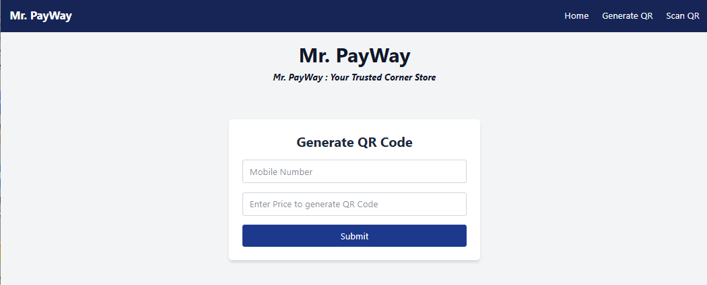
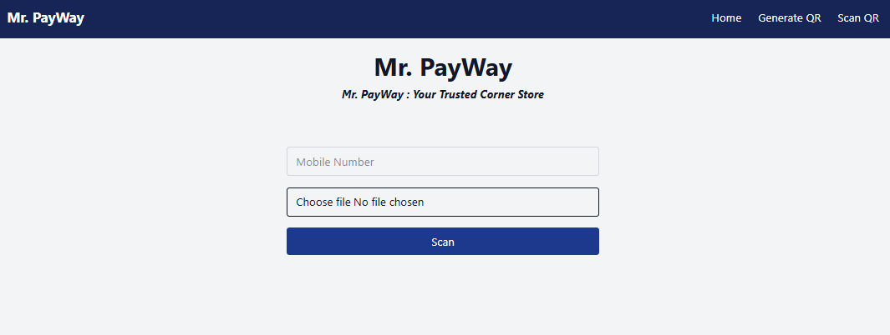

---

# 💸 MrPayWay – QR Code Generator & Scanner

**MrPayWay** is a Django-based web tool for **generating** and **scanning** QR codes. With a clean Tailwind CSS UI and real-time QR decoding via OpenCV, it's designed for fast, secure, and practical QR workflows.

---

## 🖼️ Screenshots

| Home Page                     | QR Generator                          | QR Scanner                    |
| ----------------------------- | ------------------------------------- | ----------------------------- |
|  |  |  |

> 📁 Place all screenshots inside a `/screenshots` folder in your project root.

---

## 🚀 Features

* ✅ Generate QR codes from any input text (e.g., UPI, contact, URLs)
* ✅ Scan QR codes using your webcam or uploaded image
* ✅ Minimal, responsive UI with Tailwind CSS
* ✅ Secure memory-based image handling (no file writes)
* ✅ Realtime decoding using OpenCV

---

## 🌐 Local Endpoints

* 🔗 **Generate QR:** `http://127.0.0.1:8000/scanner/generate/`
* 📸 **Scan QR:** `http://127.0.0.1:8000/scanner/scan/`

---

## 🛠️ Setup & Installation

1. **Clone the Repo**

```bash
git clone https://github.com/abh0x1/MrPayWay.git
cd MrPayWay
```

2. **Install Python Dependencies**

```bash
pip install -r requirements.txt
```

3. **Build Tailwind CSS**

```bash
npx tailwindcss -i ./src/styles/tailwind.css -o ./static/css/style.css --watch
```

> Requires [Node.js](https://nodejs.org/) and `npx`

4. **Run the Django Server**

```bash
python manage.py runserver
```

---

## 🧪 How to Use

* Visit `/scanner/generate/` → input text → generate & download QR code
* Visit `/scanner/scan/` → use webcam or upload image → extract content

---

## 📁 Project Overview

```
MrPayWay/
├── scanner/
│   ├── views.py
│   └── templates/scanner/
│       ├── generate.html
│       └── scan.html
├── static/css/style.css         # Tailwind output
├── src/styles/tailwind.css      # Tailwind input
├── manage.py
└── requirements.txt
```

---

## 📦 Built With

* Django
* Tailwind CSS
* OpenCV (`cv2`)
* Pillow
* qrcode

---

## 👨‍💻 Author

**Abhishek Kumar Verma**
---

